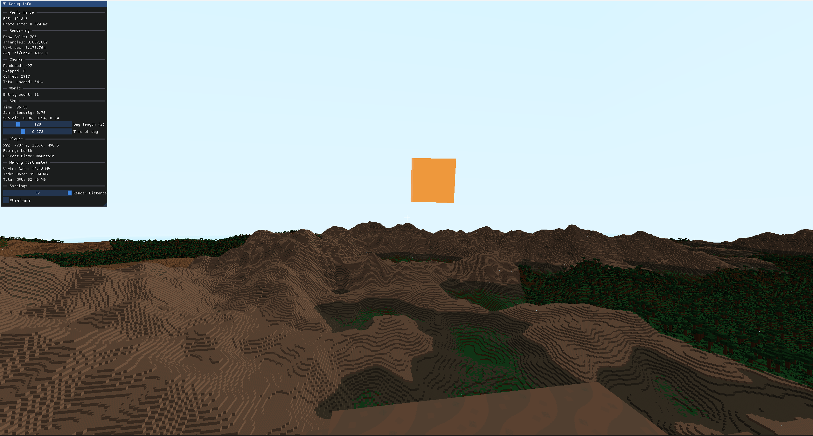

# Voxel Engine

A voxel engine written from scratch in C++20 and OpenGL — chunked world streaming,
procedural terrain, greedy meshing, frustum culling, a day/night cycle and 3D positional
audio. It runs natively on desktop and, compiled to WebAssembly, directly in a browser.

In the spirit of Minecraft and Cube World, built to learn how OpenGL and overall rendering works.



### [Play it in your browser](https://kassime5.github.io/VoxelEngine/)

---

## Features

**World**

- 64 × 256 × 64 chunks, streamed in and out around the player
- Procedural terrain from Perlin noise, with Worley-cell biome placement
- Four biomes – Forest, Desert, Mountain, Ocean
- Eight block types plus air

**Rendering**

- Greedy meshing: coplanar faces of the same block merge into single quads
- Frustum culling per chunk, with separate opaque and transparent passes
- Texture atlas with per-tile UV addressing
- Directional sun with per-face shading, a moving sun and moon, and a day/night cycle
- Cubemap skybox

**Simulation**

- AABB collision with per-axis resolution, walking and free-flight movement
- Entities with simple AI, spawned per chunk
- 3D positional audio through OpenAL

**Platforms**

- Desktop: multithreaded chunk generation and meshing
- Web: single-threaded, budgeted per frame, with an HTML stats panel

## Controls

|                    |                                |
|--------------------|--------------------------------|
| `W` `A` `S` `D`    | Move                           |
| Mouse              | Look                           |
| `Space`            | Jump or ascend while flying    |
| `Left Ctrl`        | Crouch or descend while flying |
| `Left Shift`       | Sprint                         |
| `F`                | Toggle flight                  |
| `R`                | Generate a new world           |
| Left / Right click | Break / place block            |
| `F1`               | Debug overlay (desktop)        |
| `F3`               | Entity hitboxes                |
| `Esc`              | Release the mouse              |

## Building

Requires CMake 3.20+ and a C++20 compiler. All dependencies are vendored in
`thirdparty/`, so there is nothing to install first.

### Desktop

```bash
cmake -S . -B build -DCMAKE_BUILD_TYPE=Release
cmake --build build -j
```

The executable lands in `build/` alongside a copy of `assets/`.

### Web

Requires the Emscripten SDK
on your PATH.

```bash
emcmake cmake -S . -B build-web -DCMAKE_BUILD_TYPE=Release
```

```bash
cmake --build build-web -j
```

This produces `GLFWVoxel.html`, `.js`, `.wasm` and a `.data` bundle containing the assets.
Serve the directory over HTTP,

e.g.

```bash
python -m http.server --directory build-web
```

### Force single thread on Desktop

```bash
cmake -S . -B build -DGLFWVOXEL_SINGLE_THREADED=ON
```

Runs chunk generation and meshing on the main thread under a per-frame time budget, exactly as the web build does.

## Implementation notes

**Greedy meshing.** Each chunk is meshed by sweeping the three axes and building, for
every slice, a mask of the faces that need drawing. Runs of identical faces then merge
into single quads, which cuts the triangle count on flat terrain by an order of magnitude.
Vertices are packed into 8 bytes: position as three bytes, then tile index, corner index,
normal id and the merged quad's width and height, so the merged size travels with the
vertex and the fragment shader tiles the atlas across it.

**Threading.** Desktop runs two worker pools, six threads each: one generating chunk
voxel data, one building mesh data from it. GPU uploads are queued back to the main thread,
since the GL context belongs to it. The browser has no threads available, so the
web build instead drains the same work queues on the main thread inside a 6 ms budget.

**Web port.** The same shaders serve both targets: the `#version` line is stripped and
replaced at load time, so desktop gets `#version 460 core` and the browser gets
`#version 300 es` with the precision qualifiers GLSL ES requires. `src/core/GL.h` is the
single place either GLAD or `<GLES3/gl3.h>` enters the project. ImGui is compiled out of
the web build entirely; the browser gets an HTML panel.

## Project layout

```
src/
  core/       engine loop, window, GL header switch, debug UI
  world/      chunks, terrain generation, biomes, day/night cycle
  rendering/  shaders, meshes, texture atlas, frustum, sky
  game/       player, entities, sound
  input/      input manager and player controller
assets/       shaders, textures, models, audio
thirdparty/   vendored dependencies
```

## Third-party

Each keeps its own license:

| Component | Version | License | Text |
|---|---|---|---|
| [GLFW](https://www.glfw.org/) | 3.4 | zlib/libpng | `thirdparty/glfw-3.4/LICENSE.md` |
| [GLM](https://github.com/g-truc/glm) | 1.0.2 | Happy Bunny **or** MIT | `thirdparty/glm/copying.txt` |
| [glad](https://glad.dav1d.de/) | 0.1.36 | MIT; Khronos specs Apache-2.0 / MIT | `thirdparty/glad/LICENSE` |
| [Dear ImGui](https://github.com/ocornut/imgui) | 1.92.6 | MIT | `thirdparty/imgui/LICENSE.txt` |
| [stb_image](https://github.com/nothings/stb) | — | MIT **or** public domain | end of `src/stb_image.h` |
| [PerlinNoise](https://github.com/Reputeless/PerlinNoise) | — | MIT | `thirdparty/PerlinNoise/LICENSE` |
| [OpenAL Soft](https://openal-soft.org/) | 1.25.2 | LGPL-2.1 | `thirdparty/AL/COPYING` |

OpenAL Soft is dynamically linked as a drop-in replaceable `OpenAL32.dll`; its source is
at [kcat/openal-soft](https://github.com/kcat/openal-soft). The bundled DLL also contains
pffft (`thirdparty/AL/LICENSE-pffft`). The web build links Emscripten's own OpenAL
implementation instead and bundles none of it.

## Credits

Block textures, skybox and SFX are from [Kenney](https://kenney.nl/assets) (CC0).
`assets/music/MusicAmbianceMono.wav` was made by me in [BeepBox](https://www.beepbox.co).

## License

MIT — see [LICENSE](LICENSE).


## Roadmap

- Ambient occlusion at block corners
- Flood-fill light propagation for skylight and block light
- Shadows
- Structure generation
- Fix model orientation and floating offset

## References

- [LearnOpenGL](https://learnopengl.com/)
- [Vercidium](https://www.youtube.com/@Vercidium)
- [Tantan](https://www.youtube.com/@Tantandev)
- [The Cherno](https://www.youtube.com/@TheCherno)
- [CarboneDev](https://www.youtube.com/@CarboneDev)
- [MaxMakesGames](https://www.youtube.com/@MaxMakesGames)
- [ZygerGFX](https://www.youtube.com/@ZygerGFX)

